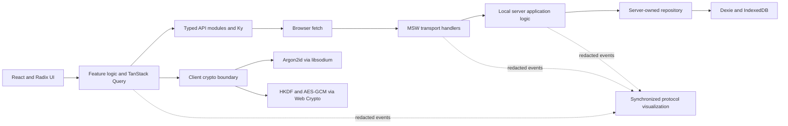

# Blind Journal

Blind Journal is an educational, frontend-only simulation of a production-grade,
zero-knowledge, end-to-end encrypted personal journal.

Users can create an account, sign in, and manage private journal entries through the same
client-side API and cryptographic boundaries that a real deployment would use. Alongside the
journal, a synchronized visualization explains how credentials, keys, HTTPS requests, sessions,
ciphertext, and server-side authorization move through the system.

> [!IMPORTANT]
> Everything physically executes in one browser. The client, network, server, and database are
> intentionally modeled as separate trust boundaries, but they are not genuinely isolated in the
> simulation. The application must clearly distinguish simulated guarantees from guarantees that
> require a separately deployed HTTPS backend.

## Why this project exists

End-to-end encryption is often explained as a collection of isolated primitives. Blind Journal
demonstrates the complete application protocol instead:

- How registration and username-first login work without sending the master password to the
  server.
- How password-derived material is separated into independent keys.
- How a server authenticates a client without gaining the journal decryption key.
- How journal data is encrypted before crossing the client boundary.
- How opaque sessions, authorization, validation, and browser security controls fit around the
  cryptography.
- How the same browser client can later target a real backend without rewriting its UI or crypto
  workflow.

This is the product-security meaning of “zero knowledge”: the server cannot decrypt journal
contents or obtain the client’s secret keys. It is not a mathematical zero-knowledge-proof system
and does not use zk-SNARKs or similar proof protocols.

## Product behavior

Blind Journal is designed to provide:

- Explicit create-account and sign-in flows; an unknown login never silently creates an account.
- A username-first login that retrieves the account’s password KDF salt before accepting the
  password.
- A responsive journal workspace with multiple dated entries, search, favorites, moods, tags,
  and a Tiptap rich-text editor.
- Create, read, update, and delete operations through an ordinary HTTP client boundary.
- English and Spanish interfaces with locale-aware routing, metadata, plurals, dates, and times.
- Installable PWA branding and a theme-aware interface.
- A replayable visualization driven by the application’s real protocol events rather than a
  prerecorded animation.

There are no built-in accounts or credentials. Every account begins with the create-account flow.

## Trust model

The intended deployment model has four logical boundaries:

1. **Client UI** — collects credentials, displays decrypted journal data while unlocked, and owns
   all user-facing text.
2. **Client crypto boundary** — derives and owns keys, encrypts outgoing journal payloads, and
   decrypts incoming ciphertext.
3. **HTTPS API** — transports agreed request and response contracts and authenticates requests
   through an opaque session.
4. **Server and database** — validate requests, authenticate and authorize users, and persist
   authentication verifiers, sessions, wrapped keys, and encrypted journal records.

MSW and the local server reproduce the last two boundaries in the browser. They must remain behind
real `fetch` requests so replacing them with a remote API only changes configuration and backend
deployment—not React components, TanStack Query hooks, endpoint functions, or client cryptography.

### What the server may know

A practical encrypted service still observes some metadata, including:

- The pseudonymous username and opaque user identifier.
- Account KDF salt and versioned KDF parameters.
- Authentication verifier material.
- Opaque session records.
- Ciphertext sizes, record counts, revisions, request timing, and access patterns.

The journal payload—including its human-readable title, body, date, mood, and tags—must be encrypted
before it crosses the client boundary.

### What the server must never receive

- The master password.
- The password-derived master key.
- The key-encryption key.
- An unwrapped vault key or entry key.
- Decrypted journal content.

## Authentication and key hierarchy

Blind Journal uses established cryptographic primitives and a custom, versioned application
protocol. The application defines how keys and envelopes are organized; audited libraries perform
the cryptographic operations.

### Create account

1. The client submits a normalized username to the account-salt endpoint.
2. The server rejects an existing username or generates a cryptographically random per-account
   salt.
3. The client derives a 256-bit master key from the password and salt using Argon2id.
4. HKDF-SHA-256 derives independent, domain-separated material for authentication and key
   encryption.
5. The client generates a random vault key and wraps it with the key-encryption key.
6. Over an assumed HTTPS connection, the client sends the username, derived authentication key,
   wrapped vault key, and versioned protocol metadata—not the password or decryption keys.
7. The server hashes the received authentication key before storing its verifier and completes
   registration with an opaque session.

### Sign in

1. The client submits the username.
2. The server retrieves the account’s salt and versioned KDF parameters.
3. The client accepts the password and derives the same master, authentication, and key-encryption
   material locally.
4. The client sends the derived authentication key over the assumed HTTPS connection.
5. The server hashes the candidate and compares it with the stored verifier using a constant-time
   byte comparison.
6. On success, the server creates an opaque, expiring, revocable session. A real backend delivers
   its identifier in a `Secure`, `HttpOnly`, appropriately `SameSite` cookie.
7. The client receives the wrapped vault key and unwraps it locally before decrypting journal
   entries.

Blind Journal deliberately does not use JWTs for browser sessions. A random opaque session ID keeps
authorization state revocable and avoids putting unnecessary claims in a client-held token.

### Journal encryption

- Journal payloads use authenticated encryption with AES-256-GCM.
- Every encryption uses a fresh, unpredictable 96-bit IV.
- Authenticated additional data binds the ciphertext to versioned context such as the account,
  entry, and revision.
- Ciphertext envelopes include only the fields required to select the protocol version and perform
  authenticated decryption.
- Password changes rederive key-encryption material and rewrap the vault key instead of requiring
  every journal entry to be encrypted again.
- Passwords, raw keys, plaintext payloads, and session identifiers never enter logs, URLs, query
  keys, state-machine inspection data, analytics, or visualization events.

## Architecture



### Boundary rules

- UI and feature code call endpoint functions under `api/`; they never call MSW handlers, local
  server functions, or the database directly.
- `api/` owns browser endpoint functions and the shared request, response, error-code, and domain
  types for each API area.
- The Ky client is intentionally thin: base URL, credentials, stable headers, and transport
  defaults. It does not hide requests behind a generic abstraction or normalize a contract the
  project controls.
- `local-server/` is unmistakably server-side application code. It consumes shared API types,
  validates untrusted requests with Zod, owns business and authorization decisions, and constructs
  typed responses.
- MSW handlers are transport adapters only. They match HTTP requests and delegate them to the local
  server without containing business logic.
- The persistence implementation belongs behind the local-server boundary. Client code must not
  import Dexie.

### API response contract

Endpoints return one consistent discriminated response:

```ts
type ApiResponse<T> =
  | { success: true; data: T }
  | {
      success: false;
      error: {
        code: string;
        message?: string;
      };
    };
```

The server owns stable machine-readable error codes. The optional message is diagnostic, not final
interface copy. The client maps codes to localized user-facing messages. Raw transport responses do
not leak beyond the endpoint boundary.

### State ownership

| State                                                              | Owner                   |
| ------------------------------------------------------------------ | ----------------------- |
| Requests, mutations, session view, and unlocked journal query data | TanStack Query          |
| Form fields, editor drafts, and local display controls             | React component state   |
| Multi-step authentication, locking, saving, and playback workflows | XState actors           |
| Password-derived and unwrapped key material                        | Client crypto boundary  |
| Accounts, verifiers, sessions, wrapped keys, and ciphertext        | Server-owned repository |
| Sanitized protocol timeline and playback position                  | Simulation workflow     |

TanStack Query is used directly rather than hidden behind a generic `useApi` abstraction. Local
React state remains local. XState is reserved for workflows that genuinely benefit from explicit
states and transitions; it is not a replacement for every boolean or form field.

## Technology choices

| Responsibility                            | Technology                   | Reason                                                                             |
| ----------------------------------------- | ---------------------------- | ---------------------------------------------------------------------------------- |
| Application framework                     | Next.js App Router and React | Server/Client Component composition, routing, metadata, and production builds      |
| Language                                  | TypeScript in strict mode    | Compile-time contracts and aggressive detection of unsafe or unused code           |
| UI system                                 | Radix Themes and Radix Icons | Accessible primitives, coherent tokens, and responsive component APIs              |
| Rich-text editor                          | Tiptap                       | A maintained editor framework instead of a custom `contenteditable` implementation |
| HTTP client                               | Ky                           | A small standards-based client over `fetch`                                        |
| Async state                               | TanStack Query               | Explicit request, mutation, caching, and invalidation behavior                     |
| Workflow state                            | XState                       | Inspectable deterministic flows for authentication and simulation playback         |
| Runtime validation                        | Zod                          | Validation of data entering server and persistence boundaries                      |
| HTTP simulation                           | MSW                          | Real browser requests with a replaceable server transport boundary                 |
| Simulated persistence                     | Dexie and IndexedDB          | Structured, versioned browser persistence behind the server boundary               |
| Password KDF and constant-time operations | libsodium                    | Audited Argon2id, secure randomness, encodings, and byte comparison                |
| Key derivation and encryption             | Web Crypto API               | Native HKDF-SHA-256 and AES-256-GCM                                                |
| Localization                              | next-intl and Eloqnt         | Next.js-native routing and formatting with typed, synchronized message catalogs    |
| Motion                                    | Motion for React             | Coordinated protocol visualization without hand-built animation infrastructure     |
| Unit tests                                | Vitest                       | Fast focused tests for protocol and API behavior                                   |
| Formatting and linting                    | Biome                        | One deterministic code-quality and formatting tool                                 |

Exact installed versions and the package-manager version are pinned in `package.json` and
`pnpm-lock.yaml`.

## Project structure

```text
api/                    Client endpoint functions and shared API/domain types
app/                    Next.js routes, locale layout, metadata, and providers
components/             React UI grouped by owning domain
  auth/                 Authentication screens and auth-only form composition
  journal/              Journal workspace and its editor, navigation, and dialogs
  brand-mark.tsx        The small cross-domain brand component
crypto/                 Cryptographic helpers and client/server protocol boundaries
hooks/                  Small reusable React hooks
i18n/                   Locale routing, navigation, message loading, and type integration
local-server/           Simulated server validation, business rules, auth, and persistence access
messages/               Translation catalogs as messages/{locale}/{feature}.json
mocks/                  MSW browser setup and thin HTTP transport handlers
public/                 Brand assets, install icons, and the generated MSW worker
tests/                  Shared Vitest setup and test-only boundary fixtures
```

Directories express concrete ownership. Avoid generic dumping grounds, duplicate contract folders,
and multiple unrelated locations for the same API area.

## Internationalization

All user-facing interface text—including labels, placeholders, errors, success messages, metadata,
tooltips, and accessibility labels—belongs in the message catalogs. User content, protocol values,
error codes, identifiers, and developer diagnostics are not translations.

```text
messages/
  en/
    auth.json
    common.json
    journal.json
    ...
  es/
    auth.json
    common.json
    journal.json
    ...
```

Each component requests the smallest useful namespace directly through `useTranslations`. Async
Server Components and metadata use `getTranslations`. Locale-aware navigation comes from the
wrappers in `i18n/navigation.ts`, and ICU messages handle interpolation and plurals without string
concatenation.

English defines the TypeScript message shape. Spanish mirrors it. `pnpm i18n:check` runs Eloqnt in
strict mode so missing, unused, malformed, or inconsistent messages fail validation.

## UI and styling policy

Radix Themes is the application design system.

- Prefer the semantic Radix Themes component that matches the job.
- Use component variants, responsive props, spacing props, layout primitives, and theme tokens.
- Compose Radix primitives according to their documented semantics and accessibility behavior.
- Use Radix Icons for interface iconography.
- Do not add Tailwind, a second design system, custom UI primitives, or application-specific CSS
  classes to reproduce behavior Radix already provides.
- Global CSS is limited to documented library setup and true document-level integration that
  cannot be expressed through the Radix Themes API.

## PWA behavior

Blind Journal is designed as an installable, theme-aware web application with vector branding,
browser icons, Apple touch artwork, and maskable install icons.

Installation does not imply offline support. MSW controls the root Service Worker scope in the
simulation; any future offline caching must use a deliberate merged-worker strategy rather than
registering a competing root Service Worker.

## Getting started

### Requirements

- Node.js 24 or newer
- Corepack
- A modern browser with Web Crypto, Web Workers, IndexedDB, and Service Worker support

Corepack selects the PNPM version pinned by the repository.

```bash
corepack enable
pnpm install --frozen-lockfile
cp .env.example .env.local
pnpm dev
```

Open [http://localhost:3000](http://localhost:3000). The locale router directs the browser to the
appropriate English or Spanish route.

`localhost` is treated as a secure development context by browsers. Any deployed version must use
HTTPS.

### Environment

| Variable                   | Purpose                                        | Example   |
| -------------------------- | ---------------------------------------------- | --------- |
| `NEXT_PUBLIC_API_BASE_URL` | Client-visible base URL used by the API client | `/api/v1` |

The application validates required environment variables at startup and fails fast when they are
missing or malformed. `NEXT_PUBLIC_` values are always visible in the browser and must never contain
secrets.

## Commands

| Command             | Purpose                                                     |
| ------------------- | ----------------------------------------------------------- |
| `pnpm dev`          | Start the Next.js development server                        |
| `pnpm build`        | Compile and validate a production build                     |
| `pnpm start`        | Serve a completed production build                          |
| `pnpm lint`         | Run Biome lint rules                                        |
| `pnpm format`       | Format supported files with Biome                           |
| `pnpm format:check` | Check formatting without changing files                     |
| `pnpm quality`      | Run Biome formatting, linting, and import checks            |
| `pnpm quality:fix`  | Apply safe Biome formatting and lint fixes                  |
| `pnpm i18n:check`   | Strictly validate translation usage and catalog consistency |
| `pnpm typecheck`    | Run TypeScript without emitting files                       |
| `pnpm test`         | Run the focused Vitest suite once                           |
| `pnpm test:watch`   | Run Vitest in watch mode                                    |
| `pnpm check`        | Run quality, localization, TypeScript, and unit-test checks |

Before handing off a change, run:

```bash
pnpm check
pnpm build
```

## Testing strategy

Tests concentrate on boundaries where a regression would undermine the protocol:

- Account creation exercises validation failures, retries, server-issued salts, successful
  registration, session behavior, and duplicate usernames as one coherent scenario.
- Login begins with a server-side user fixture and exercises unknown usernames, incorrect
  credentials, unauthorized sessions, and a successful retry.
- Journal API coverage exercises create, read, update, and delete through the MSW HTTP boundary.
- Cryptographic envelope, encoding, and key-schedule tests should use deterministic fixtures and
  published primitive behavior without weakening production parameters.

Broad browser automation and snapshot-heavy testing are intentionally out of scope. Focused unit
tests, production builds, and manual browser verification provide proportionate confidence for an
educational simulation.

## Security requirements

The implementation must preserve these rules:

- Use cryptographically secure randomness for salts, IVs, keys, session identifiers, and CSRF
  material.
- Version KDF parameters, HKDF context labels, encrypted envelopes, and authenticated metadata.
- Keep passwords and unlocked keys short-lived and outside persistent React, Query, and XState
  state.
- Clear private query data and key material on lock or logout.
- Validate untrusted request and persisted data at the server boundary.
- Authorize every journal operation against the authenticated user.
- Use generic credential failures, rate limiting, and decoy KDF parameters where appropriate to
  reduce account enumeration.
- Use opaque, expiring, revocable sessions with origin and CSRF protection for authenticated
  mutations.
- Enforce HTTPS, a restrictive Content Security Policy, and appropriate browser security headers in
  a real deployment.
- Never treat browser-delivered code, simulated cookies, or simulated server secrets as genuine
  isolation.

No browser application can protect unlocked plaintext from arbitrary code already executing in the
same origin. Preventing XSS and limiting third-party script execution are therefore part of the
cryptographic security boundary, not merely UI concerns.

## Scope

Blind Journal focuses on a personal journal and its security protocol. Sharing, multi-user
collaboration, attachments, a real hosted authentication service, and claims of hiding all traffic
metadata are outside the project’s scope.

Development proceeds in explicitly approved, reviewable changes. The architecture describes the
intended destination, not authorization to implement unrelated phases automatically.

## References

- [Next.js documentation](https://nextjs.org/docs)
- [next-intl documentation](https://next-intl.dev/docs/getting-started/app-router)
- [Radix Themes documentation](https://www.radix-ui.com/themes/docs/overview/getting-started)
- [MSW browser integration](https://mswjs.io/docs/integrations/browser)
- [TanStack Query documentation](https://tanstack.com/query/latest/docs/framework/react/overview)
- [Web Crypto API](https://developer.mozilla.org/en-US/docs/Web/API/Web_Crypto_API)
- [OWASP Password Storage Cheat Sheet](https://cheatsheetseries.owasp.org/cheatsheets/Password_Storage_Cheat_Sheet.html)
- [OWASP Cryptographic Storage Cheat Sheet](https://cheatsheetseries.owasp.org/cheatsheets/Cryptographic_Storage_Cheat_Sheet.html)
