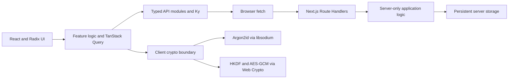

# Blind Journal

Blind Journal is a private, zero-knowledge, end-to-end encrypted personal journal.

Users can create an account, sign in, and manage journal entries without giving the server the
password, encryption keys, or plaintext needed to read them. The browser owns key derivation and
encryption; the Next.js API owns authentication, authorization, sessions, validation, and storage.

## Why this project exists

End-to-end encryption is only useful when the surrounding application protocol preserves its
guarantees. Blind Journal brings those responsibilities together:

- How registration and username-first login work without sending the master password to the
  server.
- How password-derived material is separated into independent keys.
- How a server authenticates a client without gaining the journal decryption key.
- How journal data is encrypted before crossing the client boundary.
- How opaque sessions, authorization, validation, and browser security controls fit around the
  cryptography.
- How a stable HTTP boundary keeps React components independent from server implementation details.

This is the product-security meaning of “zero knowledge”: the server cannot decrypt journal
contents or obtain the client’s secret keys. It is not a mathematical zero-knowledge-proof system
and does not use zk-SNARKs or similar proof protocols.

## Product behavior

Blind Journal is designed to provide:

- Explicit create-account and sign-in flows; an unknown login never silently creates an account.
- A login flow that retrieves the account’s password KDF salt before deriving credentials locally.
- A responsive journal workspace with multiple dated entries, search, favorites, tags, and a
  Tiptap rich-text editor.
- Create, read, update, and delete operations through an ordinary HTTP client boundary.
- English and Spanish interfaces with locale-aware routing, metadata, plurals, dates, and times.
- Installable PWA branding and a theme-aware interface.

There are no built-in accounts or credentials. Every account begins with the create-account flow.

## Trust model

The intended deployment model has four logical boundaries:

1. **Client UI** — collects credentials, displays decrypted journal data while unlocked, and owns
   all user-facing text.
2. **Client crypto boundary** — derives and owns keys, encrypts outgoing journal payloads, and
   decrypts incoming ciphertext.
3. **HTTPS API** — transports agreed request and response contracts and authenticates requests
   through an opaque session.
4. **Server** — validates requests, authenticates and authorizes users, and persists authentication
   verifiers, sessions, wrapped entry keys, and encrypted journal records.

The browser communicates with versioned Next.js Route Handlers through ordinary same-origin HTTP
requests. React components and TanStack Query hooks depend only on the endpoint functions under
`api/`, so storage and server implementation details never leak into the interface.

### What the server may know

A practical encrypted service still observes some metadata, including:

- The pseudonymous username and opaque user identifier.
- Account KDF salt.
- Authentication verifier material.
- Opaque session records.
- Entry creation and update timestamps, ciphertext sizes, record counts, request timing, and access
  patterns.

The journal payload—including its title, body, favorite status, and tags—must be encrypted before it
crosses the client boundary.

### What the server must never receive

- The master password.
- The password-derived master key.
- The password-derived key-encryption key.
- An unwrapped journal entry key.
- Decrypted journal content.

## Authentication and key hierarchy

Blind Journal uses established cryptographic primitives and a custom, versioned application
protocol. The application defines how keys and envelopes are organized; audited libraries perform
the cryptographic operations.

### Create account

1. The client submits a normalized username to the account-salt endpoint.
2. The server rejects an existing username or generates a cryptographically random per-account
   salt.
3. The client derives a 256-bit master key from the password and salt using Argon2id.
4. HKDF-SHA-256 derives independent, domain-separated authentication and key-encryption material.
5. Over HTTPS, the client sends the username and derived authentication key—not the password or
   journal decryption key.
6. The server hashes the received authentication key before storing its verifier and completes
   registration with an opaque session.
7. The client keeps the derived key-encryption key in memory while the journal is unlocked.

### Sign in

1. The client submits the username.
2. The server retrieves the account’s salt.
3. The client accepts the password and derives the same master, authentication, and key-encryption
   material locally.
4. The client sends the derived authentication key over HTTPS.
5. The server hashes the candidate and compares it with the stored verifier using a constant-time
   byte comparison.
6. On success, the server creates an opaque, expiring, revocable session and delivers its
   identifier in a `Secure`, `HttpOnly`, appropriately `SameSite` cookie.
7. The client keeps the rederived key-encryption key in memory and uses it to unwrap each journal
   entry key locally.

Blind Journal deliberately does not use JWTs for browser sessions. A random opaque session ID keeps
authorization state revocable and avoids putting unnecessary claims in a client-held token.

### Journal encryption

- Journal payloads use authenticated encryption with AES-256-GCM.
- Every encryption uses a fresh, unpredictable 96-bit IV.
- Every journal entry has a random encryption key wrapped by the password-derived key-encryption
  key. Its ciphertext, IV, and wrapped key are stored together.
- Authenticated additional data binds the ciphertext to versioned context such as the account,
  entry, and revision.
- Ciphertext envelopes include only the fields required to select the protocol version and perform
  authenticated decryption.
- Passwords, raw keys, plaintext payloads, and session identifiers never enter logs, URLs, query
  keys, or analytics.

## Architecture



### Boundary rules

- UI code calls endpoint functions under `api/`; it never imports Route Handlers, server services,
  test handlers, or persistence code.
- `api/` owns browser endpoint functions and the shared request, response, error-code, and domain
  types for each API area.
- The Ky client is intentionally thin: base URL, credentials, stable headers, and transport
  defaults. It does not hide requests behind a generic abstraction or normalize a contract the
  project controls.
- `app/api/v1/` contains thin Route Handlers. They apply HTTP concerns, call server services, and
  return the agreed response shape.
- `server/` contains server-only authentication, session, journal, and persistence logic. It
  validates untrusted input with the Zod schemas colocated with each API area.
- Storage belongs behind the server boundary. Client code never imports its implementation.

### API response contract

A successful endpoint returns its data directly. Any error uses an appropriate non-2xx HTTP status
and a body containing only its stable, domain-namespaced code:

```ts
type ApiError<TCode extends string> = { code: TCode };
```

Ky preserves its native HTTP, network, and timeout error classes while attaching that code for the
UI. A compile-time exhaustive mapping keeps stable codes independent from the locale catalog, and
callers intentionally choose the fallback for unknown codes. Diagnostic details remain on the
server rather than crossing the API boundary.

### State ownership

| State                                                              | Owner                   |
| ------------------------------------------------------------------ | ----------------------- |
| Requests, mutations, and unlocked journal query data               | TanStack Query          |
| Form fields, editor drafts, and local display controls             | React component state   |
| Password-derived and unwrapped entry-key material                  | Client crypto boundary  |
| Accounts, verifiers, sessions, wrapped entry keys, and ciphertext  | Server persistence      |

TanStack Query is used directly rather than hidden behind a generic `useApi` abstraction. Local
React state remains local.

## Technology choices

| Responsibility                            | Technology                   | Reason                                                                             |
| ----------------------------------------- | ---------------------------- | ---------------------------------------------------------------------------------- |
| Application framework                     | Next.js App Router and React | Server/Client Component composition, routing, metadata, and production builds      |
| Language                                  | TypeScript in strict mode    | Compile-time contracts and aggressive detection of unsafe or unused code           |
| UI system                                 | Radix Themes and Radix Icons | Accessible primitives, coherent tokens, and responsive component APIs              |
| Rich-text editor                          | Tiptap                       | A maintained editor framework instead of a custom `contenteditable` implementation |
| HTTP client                               | Ky                           | A small standards-based client over `fetch`                                        |
| Async state                               | TanStack Query               | Explicit request, mutation, caching, and invalidation behavior                     |
| Runtime validation                        | Zod                          | Validation of data entering server and persistence boundaries                      |
| Password KDF and constant-time operations | libsodium                    | Audited Argon2id, secure randomness, encodings, and byte comparison                |
| Key derivation and encryption             | Web Crypto API               | Native HKDF-SHA-256 and AES-256-GCM                                                |
| Localization                              | next-intl and Eloqnt         | Next.js-native routing and formatting with typed, synchronized message catalogs    |
| Unit tests                                | Vitest                       | Fast focused tests for cryptographic and domain behavior                           |
| Formatting and linting                    | Biome                        | One deterministic code-quality and formatting tool                                 |

Exact installed versions and the package-manager version are pinned in `package.json` and
`pnpm-lock.yaml`.

## Project structure

```text
api/                    Client endpoint functions, shared request types, and Zod schemas
app/                    Next.js pages, layouts, providers, and versioned API Route Handlers
components/             React UI grouped by owning domain
  auth/                 Authentication screens and auth-only form composition
  journal/              Journal workspace and its editor, navigation, and dialogs
  brand-mark.tsx        The small cross-domain brand component
crypto/                 Cryptographic helpers and client/server protocol boundaries
hooks/                  Small reusable React hooks
i18n/                   Locale routing, navigation, message loading, and type integration
messages/               Translation catalogs as messages/{locale}/{feature}.json
public/                 Brand assets and install icons
server/                 Server-only auth, session, journal, and persistence logic
```

Directories express concrete ownership. Avoid generic dumping grounds, duplicate contract folders,
and multiple unrelated locations for the same API area.

## Internationalization

All user-facing interface text—including labels, placeholders, errors, success messages, metadata,
tooltips, and accessibility labels—belongs in the message catalogs. User content, protocol values,
error codes, identifiers, and developer diagnostics are not translations.

```text
messages/
  en/
    auth.json
    common.json
    journal.json
    ...
  es/
    auth.json
    common.json
    journal.json
    ...
```

Each component requests the smallest useful namespace directly through `useTranslations`. Async
Server Components and metadata use `getTranslations`. Locale-aware navigation comes from the
wrappers in `i18n/navigation.ts`, and ICU messages handle interpolation and plurals without string
concatenation.

English defines the TypeScript message shape. Spanish mirrors it. `pnpm i18n:check` runs Eloqnt in
strict mode so missing, unused, malformed, or inconsistent messages fail validation.

## UI and styling policy

Radix Themes is the application design system.

- Prefer the semantic Radix Themes component that matches the job.
- Use component variants, responsive props, spacing props, layout primitives, and theme tokens.
- Compose Radix primitives according to their documented semantics and accessibility behavior.
- Use Radix Icons for interface iconography.
- Do not add Tailwind, a second design system, custom UI primitives, or application-specific CSS
  classes to reproduce behavior Radix already provides.
- Global CSS is limited to documented library setup and true document-level integration that
  cannot be expressed through the Radix Themes API.

## PWA behavior

Blind Journal is designed as an installable, theme-aware web application with vector branding,
browser icons, Apple touch artwork, and maskable install icons.

Installation does not imply offline support. Offline caching and background synchronization must be
introduced deliberately so private data is never cached outside the encrypted storage protocol.

## Getting started

### Requirements

- Node.js 24 or newer
- Corepack
- A modern browser with Web Crypto and Web Worker support

Corepack selects the PNPM version pinned by the repository.

```bash
corepack enable
pnpm install --frozen-lockfile
cp .env.example .env.local
pnpm dev
```

Open [http://localhost:3000](http://localhost:3000). The locale router directs the browser to the
appropriate English or Spanish route.

`localhost` is treated as a secure development context by browsers. Any deployed version must use
HTTPS.

### Environment

| Variable                   | Purpose                                        | Example   |
| -------------------------- | ---------------------------------------------- | --------- |
| `NEXT_PUBLIC_API_BASE_URL` | Browser-visible base URL used by the HTTP layer | `/api/v1` |

The application validates required environment variables at startup and fails fast when they are
missing or malformed. `NEXT_PUBLIC_` values are always visible in the browser and must never contain
secrets.

## Commands

| Command           | Purpose                                                     |
| ----------------- | ----------------------------------------------------------- |
| `pnpm dev`        | Start the Next.js development server                        |
| `pnpm build`      | Compile and validate a production build                     |
| `pnpm start`      | Serve a completed production build                          |
| `pnpm check`      | Run Biome, localization, TypeScript, and unit-test checks   |
| `pnpm check:fix`  | Apply safe Biome formatting, lint, and import fixes         |
| `pnpm i18n:check` | Strictly validate translation usage and catalog consistency |
| `pnpm typecheck`  | Run TypeScript without emitting files                       |
| `pnpm test`       | Run the focused Vitest suite once                           |
| `pnpm test:watch` | Run Vitest in watch mode                                    |

Before handing off a change, run:

```bash
pnpm check
pnpm build
```

## Testing strategy

Tests cover the cryptographic protocol, validation and authorization rules, and critical account and
journal flows against the real application boundaries. Test code does not maintain a parallel local
server implementation. Focused tests and production builds keep the suite fast while protecting the
security-sensitive behavior.

## Security requirements

The implementation must preserve these rules:

- Use cryptographically secure randomness for salts, IVs, keys, session identifiers, and CSRF
  material.
- Version encrypted envelopes and authenticated metadata.
- Keep passwords and unlocked keys short-lived and outside persistent React and Query state.
- Clear private query data and key material on lock or logout.
- Validate untrusted request and persisted data at the server boundary.
- Authorize every journal operation against the authenticated user.
- Use generic credential failures, rate limiting, and decoy KDF parameters where appropriate to
  reduce account enumeration.
- Use opaque, expiring, revocable sessions with origin and CSRF protection for authenticated
  mutations.
- Enforce HTTPS, a restrictive Content Security Policy, and appropriate browser security headers in
  every deployment.
- Keep server secrets and private persistence exclusively in server-only modules and infrastructure.

No browser application can protect unlocked plaintext from arbitrary code already executing in the
same origin. Preventing XSS and limiting third-party script execution are therefore part of the
cryptographic security boundary, not merely UI concerns.

## Scope

Blind Journal focuses on a personal journal and its security protocol. Sharing, multi-user
collaboration, attachments, third-party authentication providers, and claims of hiding all traffic
metadata are outside the project’s scope.

## References

- [Next.js documentation](https://nextjs.org/docs)
- [next-intl documentation](https://next-intl.dev/docs/getting-started/app-router)
- [Radix Themes documentation](https://www.radix-ui.com/themes/docs/overview/getting-started)
- [TanStack Query documentation](https://tanstack.com/query/latest/docs/framework/react/overview)
- [Web Crypto API](https://developer.mozilla.org/en-US/docs/Web/API/Web_Crypto_API)
- [OWASP Password Storage Cheat Sheet](https://cheatsheetseries.owasp.org/cheatsheets/Password_Storage_Cheat_Sheet.html)
- [OWASP Cryptographic Storage Cheat Sheet](https://cheatsheetseries.owasp.org/cheatsheets/Cryptographic_Storage_Cheat_Sheet.html)
