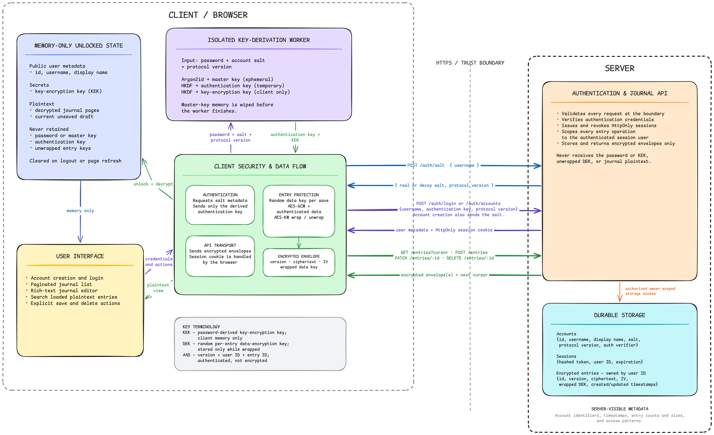
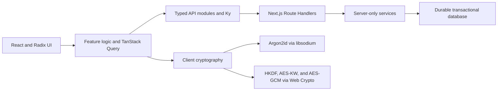

# Blind Journal

Blind Journal is a private, zero-knowledge, end-to-end encrypted personal journal.

Users create an account, sign in, and manage journal entries through a real server-backed
application. The browser derives encryption keys and encrypts journal content before sending it.
The server authenticates users, enforces authorization, manages sessions, and stores durable
encrypted records, but it never receives the password or the keys needed to decrypt the journal.

## Product goal

Blind Journal provides a complete, secure journaling experience:

- Explicit create-account and sign-in flows. An unknown sign-in never creates an account.
- Multiple dated journal entries with rich-text editing and a title filter for entries already
  loaded in the browser.
- End-to-end encrypted create, read, update, and delete operations.
- Durable server storage that preserves accounts and entries across deployments.
- Opaque, expiring, revocable browser sessions.
- Strict isolation between users at the API, service, and database layers.
- Responsive desktop and mobile layouts.
- English and Spanish interfaces with locale-aware routes, messages, dates, times, and metadata.
- Installable PWA branding and light and dark themes.

There are no built-in accounts or default credentials. Every user begins with **Create account**.

## How it works

Blind Journal separates authentication from decryption:

1. The browser derives independent authentication and encryption keys from the user's password.
2. The authentication key proves that the user knows the password, but it cannot decrypt the
   journal.
3. The key-encryption key stays in browser memory and unwraps entry keys locally.
4. Journal titles and bodies are encrypted before they cross the client boundary.
5. The server stores ciphertext and authenticates future requests with an opaque session cookie.

This separation allows the server to identify and authorize a user without gaining access to their
journal content.

## Security model

In this project, **zero knowledge** means that the server cannot decrypt journal entries or obtain
the client's journal-encryption keys. It does not mean that the server learns nothing about the
user, and it does not refer to mathematical zero-knowledge proof systems such as zk-SNARKs.

The design has four trust boundaries:

1. **Client UI** — collects credentials and displays decrypted journal content while the journal is
   unlocked.
2. **Client cryptography** — derives and owns keys, encrypts outgoing content, and decrypts incoming
   ciphertext.
3. **HTTPS API** — transports versioned contracts and authenticates requests with an opaque session
   cookie.
4. **Server application and database** — validate requests, authenticate and authorize users, and
   persist authentication verifiers, sessions, wrapped keys, metadata, and encrypted records.

### What the server can observe

End-to-end encryption protects content, not all metadata. The server can observe:

- The normalized username, display name, and opaque user identifier.
- Password-derivation salt and key-schedule version.
- Authentication-verifier material and hashed session records.
- Entry identifiers, creation and update times, ciphertext sizes, and record counts.
- Request timing, IP-derived operational data, and access patterns.

The server also receives a derived authentication key during account creation and sign-in. That key
can authenticate the user but is cryptographically separated from journal-decryption material.

### What the server must never receive

- The master password.
- The password-derived master key.
- The password-derived key-encryption key.
- An unwrapped journal-entry key.
- A plaintext journal title or body.

### Browser boundary

An unlocked journal exists as plaintext in browser memory so the user can read and edit it. No web
application can protect that plaintext from arbitrary code already executing in the same origin.
XSS prevention, dependency control, minimal third-party code, and a restrictive Content Security
Policy are therefore part of the cryptographic boundary.

## Authentication and encryption protocol

Blind Journal combines established cryptographic primitives in a versioned application protocol.
Audited libraries and browser APIs perform the cryptographic operations; application code defines
how keys, versions, and encrypted envelopes fit together.

### Terminology

| Term | Meaning |
| --- | --- |
| **Key schedule** | Versioned recipe defining the password KDF, its parameters, derived-key purposes, and encodings. |
| **Salt** | Public input to password derivation that makes the same password produce different keys for different accounts. |
| **Master key** | Short-lived 256-bit value derived from the password and salt with Argon2id. |
| **Authentication key** | HKDF-derived value sent over HTTPS to authenticate the account. It cannot decrypt journal content. |
| **Key-encryption key** | Non-extractable AES-KW key derived with HKDF and retained only in browser memory while unlocked. |
| **Entry key** | Random AES-GCM key created independently for one journal entry. |
| **Verifier** | One-way digest of the authentication key stored by the server for sign-in comparison. |
| **Wrapped key** | Entry key encrypted with the key-encryption key before server storage. |
| **IV** | Fresh, non-secret initialization vector required for each AES-GCM encryption. |
| **Authenticated additional data (AAD)** | Unencrypted context authenticated with the ciphertext so an envelope cannot be moved to another user or entry. |
| **Opaque session** | Random cookie value whose meaning, lifetime, and revocation state exist only on the server. |

### Create an account

1. The browser sends the username to the shared authentication-salt endpoint.
2. The server normalizes the username and returns a key-schedule version and salt metadata. Existing
   and unknown usernames receive the same response shape.
3. In a Web Worker, the browser derives a 256-bit master key with Argon2id.
4. HKDF-SHA-256 derives independent, domain-separated authentication and key-encryption keys.
5. Over HTTPS, the browser sends the username, salt metadata, and authentication key to the account
   endpoint. It does not send the password, master key, or key-encryption key.
6. The server validates the request, stores a one-way verifier, creates the account atomically, and
   starts an opaque session.
7. The browser keeps the non-extractable key-encryption key in memory while the journal is unlocked.

### Sign in

1. The browser requests salt metadata for the supplied username.
2. For an existing account, the server returns its stored metadata. For an unknown username, it
   returns deterministic decoy metadata with the same response shape.
3. The browser derives the same master, authentication, and key-encryption keys locally.
4. The browser sends the derived authentication key over HTTPS.
5. The server hashes the candidate and compares it with the stored verifier using timing-resistant
   verification work.
6. On success, the server creates an expiring, revocable session and sends its identifier in a
   `Secure`, `HttpOnly`, appropriately `SameSite` cookie.
7. The browser uses the rederived key-encryption key to unwrap each entry key locally.

Salt lookup, account creation, and sign-in are protected by distributed rate limits. Credential
failures remain generic so the API does not reveal whether a username or password was incorrect.

Blind Journal uses opaque sessions instead of JWTs. This keeps authorization state revocable and
avoids placing unnecessary claims in a client-held token. The database stores only a one-way hash of
each bearer session identifier.

### Encrypt a journal entry

- The title and rich-text body are serialized and encrypted with AES-256-GCM before transmission.
- Each entry has a random 256-bit AES-GCM key.
- Every encryption uses a fresh, unpredictable 96-bit IV.
- The entry key is wrapped with the user's AES-KW key-encryption key.
- AAD binds the ciphertext to the envelope version, user identifier, and entry identifier.
- The server stores the ciphertext, IV, wrapped key, protocol version, and minimum record metadata
  in a single authorized transaction.
- The title filter operates only on entries already decrypted and loaded in the browser; plaintext
  titles are not stored in a server index.

Passwords, raw keys, plaintext content, and bearer session identifiers never enter logs, URLs,
query keys, analytics, or server persistence.

### Sign out and lock

Signing out immediately removes the unlocked user, key-encryption key, decrypted query data, editor
drafts, and other private state from the browser as far as browser APIs allow. The browser also asks
the server to revoke the opaque session and clears the session cookie.

Local private state is cleared even if the revocation request fails. Reloading the application
always requires the password again before encrypted entries can be opened.

JavaScript cannot guarantee that garbage-collected memory is overwritten immediately. Blind Journal
minimizes the lifetime and number of copies of passwords, plaintext, and raw key bytes instead of
claiming perfect memory erasure.

## Delete an account

Account deletion permanently removes the account and all of its journal data:

1. The signed-in user opens the destructive account action and re-enters the master password.
2. The browser derives the authentication key locally and submits a deletion request over HTTPS.
3. The server verifies the current credentials and requires an explicit confirmation.
4. In one database transaction, the server deletes every entry and session owned by the user, then
   deletes the user record.
5. The response expires the session cookie, and the browser clears the unlocked key, private query
   data, drafts, and user state.

Deletion is irreversible. Blind Journal has no password recovery or retained copy of a deleted
journal.

## Architecture

The system keeps password-derived decryption material and journal plaintext inside the browser,
while the server authenticates requests and stores only encrypted journal envelopes and observable
account metadata:



The endpoint labels in the diagram omit the shared `/api/v1` prefix for readability.

The implementation is organized into the following layers:



### Boundary rules

- UI components call endpoint functions under `api/`. They never import Route Handlers, server
  services, or persistence code.
- `api/` owns browser endpoint functions and types or schemas shared across the HTTP boundary.
- Ky provides a thin, same-origin transport layer with credentials and stable headers.
- `app/api/v1/` contains thin Route Handlers that apply HTTP concerns and call server services.
- `server/` owns authentication, authorization, sessions, journal services, account deletion, and
  persistence.
- Untrusted API bodies and database rows are validated at their trust boundaries.
- The database implementation stays behind the server boundary.

### API response contract

Successful endpoints return their data directly. Failures use an appropriate non-2xx status and a
body containing one stable, domain-namespaced code:

```ts
type ApiError<TCode extends string> = { code: TCode };
```

Ky retains its native HTTP, network, timeout, and cancellation behavior while attaching recognized
domain codes. The UI maps known codes exhaustively to localized messages and deliberately chooses a
fallback for unknown codes. Stack traces and diagnostic details remain on the server.

### State ownership

| State | Owner |
| --- | --- |
| Requests, mutations, and decrypted journal query data | TanStack Query |
| Form fields, editor drafts, search input, and display controls | Local React state |
| Unlocked user and non-extractable key-encryption key | In-memory Zustand store |
| Accounts, verifiers, hashed sessions, wrapped keys, metadata, and ciphertext | Server database |

Unlocked keys and decrypted journal data are never persisted to browser storage. Signing out clears
both the unlocked-user state and all private query data.

## Server database

The server uses a durable transactional database as the authoritative store. It persists:

- User identifiers, normalized usernames, and display names.
- Key-schedule versions and KDF salts.
- Authentication verifiers.
- Hashed opaque sessions and expiration times.
- Encrypted journal envelopes and ownership metadata.

The schema enforces username uniqueness, user-entry ownership, bounded values, and referential
integrity. Every journal query is scoped by the authenticated user ID, and multi-step writes are
atomic. Deleting a user removes their entries and sessions in the same transaction. Process memory
is never used as a persistence fallback.

The database still cannot decrypt journal content because it never receives the key-encryption key
or an unwrapped entry key.

## Technology

| Responsibility | Technology | Why it is used |
| --- | --- | --- |
| Application framework | Next.js App Router and React | Routing, rendering, metadata, Route Handlers, and production builds |
| Language | TypeScript in strict mode | Explicit contracts and detection of unsafe or unused code |
| UI system | Radix Themes and Radix Icons | Accessible primitives, coherent tokens, and responsive APIs |
| Rich-text editor | Tiptap | Maintained document editing instead of a custom `contenteditable` implementation |
| HTTP client | Ky | Small standards-based layer over `fetch` |
| Server-state management | TanStack Query | Requests, caching, mutations, and invalidation |
| Shared unlocked state | Zustand | Small in-memory user and key state shared across the interface |
| Runtime validation | Zod | Validation at API and database boundaries |
| Password derivation | libsodium | Audited Argon2id, secure randomness, encodings, and constant-time operations |
| Key derivation and encryption | Web Crypto | Native HKDF-SHA-256, AES-KW, and AES-256-GCM |
| Database | Neon | Hosted PostgreSQL for durable application data |
| Localization | next-intl and Eloqnt | Locale routing, formatting, and synchronized message catalogs |
| Tests | Vitest | Focused protocol, service, persistence, component, and critical-flow tests |
| Formatting and linting | Biome | Deterministic formatting and static checks |

Blind Journal uses Neon to host its PostgreSQL database. PostgreSQL provides the transactions and
data constraints required by this design. Configure Neon and the application host to prevent
unexpected usage charges. Exact dependency and package-manager versions are pinned in
`package.json` and `pnpm-lock.yaml`.

## Repository map

```text
api/                    Browser endpoint functions and shared API contracts
app/                    Pages, layouts, providers, metadata, and v1 Route Handlers
components/             UI grouped by product domain
crypto/                 Low-level encryption and encoding adapters
hooks/                  Small reusable React hooks
i18n/                   Locale routing, message loading, navigation, and error mapping
messages/               Translation catalogs under messages/{locale}/{feature}.json
public/                 Brand and install assets
server/                 Server-only services, HTTP helpers, sessions, and persistence
client-state/           Small in-memory Zustand stores
types/                  String type aliases for Base64 and Base64Url values
```

Directories express ownership. Avoid generic dumping grounds, duplicate contract folders, and
multiple sources of truth for one domain.

## Internationalization and UI

All user-facing text—including labels, placeholders, errors, success messages, metadata, tooltips,
and accessibility labels—belongs in the locale catalogs. User content, protocol values, identifiers,
error codes, code comments, and developer diagnostics are not translations.

English defines the TypeScript catalog shape; Spanish mirrors it. Components request the smallest
useful namespace with `useTranslations`, server code uses `getTranslations`, and
`pnpm i18n:check` validates catalog usage and consistency in strict mode.

Radix Themes is the design system. Prefer its semantic components, responsive properties, variants,
layout primitives, and tokens. Custom CSS is reserved for document-level integration or behavior
the design system cannot express, such as the rich-text editing canvas.

## PWA behavior

Blind Journal includes installable, theme-aware metadata and branded icons. Installation does not
imply offline journal access. Offline caching and background synchronization require a separate
security design so decrypted data is never placed outside the encrypted storage protocol.

## Getting started

### Requirements

- Node.js 24 or newer
- Corepack
- A Neon account and project
- A modern browser with Web Crypto and Web Worker support

Corepack selects the PNPM version pinned by the repository.

```bash
corepack enable
pnpm install --frozen-lockfile
cp .env.example .env.local
pnpm dev
```

Open [http://localhost:3000](http://localhost:3000). Locale routing directs the browser to the
appropriate English or Spanish route. Browsers treat `localhost` as a secure development context;
every deployed environment must use HTTPS.

### Environment configuration

| Variable | Purpose |
| --- | --- |
| `AUTH_SALT_SECRET` | Base64URL-encoded server secret of at least 32 decoded bytes, used to derive enumeration-resistant salt metadata. Required in production; local development and tests have a deterministic non-production fallback. |
| `DATABASE_URL` | Server-only Neon connection string using the restricted `blind_journal_app` role and pooled endpoint. Required in every environment. |

The server validates all environment configuration together before it starts accepting requests.
Generate independent production secrets, keep `AUTH_SALT_SECRET` stable for the lifetime of stored
accounts, and never expose either value to the browser. Server modules consume the validated values
from `server/environment.ts`; Biome rejects direct `process.env` access outside that boundary and
the narrowly scoped startup and integration-test exceptions.

The browser calls the built-in `/api/v1` Route Handlers on the same origin. A separately deployed
browser API is not part of this architecture.

## Commands

| Command | Purpose |
| --- | --- |
| `pnpm dev` | Start the Next.js development server |
| `pnpm build` | Compile and validate a production build |
| `pnpm start` | Serve a completed production build |
| `pnpm check` | Run Biome, localization checks, TypeScript, and the test suite |
| `pnpm check:fix` | Apply safe Biome formatting, lint, and import fixes |
| `pnpm i18n:check` | Validate message usage and catalog consistency in strict mode |
| `pnpm typecheck` | Run TypeScript without emitting files |
| `pnpm test` | Run the Vitest suite once |
| `pnpm test:watch` | Run Vitest in watch mode |

Before handing off a change, run:

```bash
pnpm check
pnpm build
```

## Testing approach

Tests cover cryptographic round trips and tampering, key-schedule behavior, session creation,
expiration, and revocation, request validation, database constraints, per-user authorization,
cross-user isolation, query-cache cleanup, account deletion, and critical account and journal flows
through the real application boundaries.

Test code does not maintain a separate fake API implementation. Persistence tests use the real
database contract, and production builds verify the framework boundary.

## Scope

Blind Journal focuses on private personal journaling with remote accounts, server persistence, and
client-side encryption.

The following are outside its scope:

- Sharing and multi-user collaboration
- Attachments
- Third-party identity providers
- Password changes and password recovery
- Automatic offline editing or background synchronization
- Claims of hiding all network and traffic metadata

## Further reading

- [Engineering standards](./ENGINEERING_STANDARDS.md)
- [Next.js documentation](https://nextjs.org/docs)
- [next-intl documentation](https://next-intl.dev/docs/getting-started/app-router)
- [Radix Themes documentation](https://www.radix-ui.com/themes/docs/overview/getting-started)
- [TanStack Query documentation](https://tanstack.com/query/latest/docs/framework/react/overview)
- [Web Crypto API](https://developer.mozilla.org/en-US/docs/Web/API/Web_Crypto_API)
- [OWASP Password Storage Cheat Sheet](https://cheatsheetseries.owasp.org/cheatsheets/Password_Storage_Cheat_Sheet.html)
- [OWASP Cryptographic Storage Cheat Sheet](https://cheatsheetseries.owasp.org/cheatsheets/Cryptographic_Storage_Cheat_Sheet.html)
